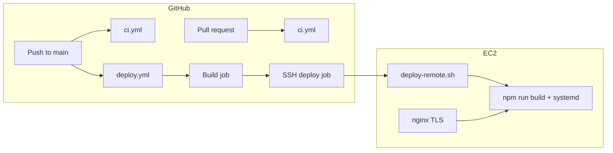

# Deployment (GitHub Actions → EC2)

This project deploys automatically when commits land on the `main` branch. CI runs on every pull request and push to `main`; production deploy runs only after a successful build on `main`.

## Architecture



The app is a TanStack Start SSR bundle. Production serves `dist/server/server.js` and static assets from `dist/client` via [`srvx`](https://srvx.h3.dev) (`npm run start`).

## One-time EC2 setup

### 1. System packages

```bash
# Node 22+ (example with nvm)
curl -fsSL https://raw.githubusercontent.com/nvm-sh/nvm/v0.40.1/install.sh | bash
nvm install 22
nvm use 22

sudo apt-get update
sudo apt-get install -y git nginx curl
```

### 2. Deploy user and app directory

```bash
sudo useradd --system --create-home --home-dir /var/www/html/webespoke --shell /bin/bash deploy
sudo mkdir -p /var/www/html/webespoke
sudo chown -R deploy:deploy /var/www/html/webespoke

sudo -u deploy git clone git@github.com:YOUR_ORG/webespoke.git /var/www/html/webespoke
cd /var/www/html/webespoke
sudo -u deploy cp .env.example .env
# Edit .env with production secrets (never commit this file)
```

### 3. systemd service

```bash
sudo cp deploy/webespoke.service /etc/systemd/system/webespoke.service
# Edit User, Group, WorkingDirectory, EnvironmentFile if needed
sudo systemctl daemon-reload
sudo systemctl enable webespoke
```

Allow the deploy user to restart the service without a password:

```bash
sudo visudo -f /etc/sudoers.d/webespoke-deploy
```

```
deploy ALL=(ALL) NOPASSWD:/bin/systemctl restart webespoke, /bin/systemctl is-active webespoke
```

### 4. nginx (optional but recommended)

Copy and edit `deploy/nginx.conf.example`, enable the site, and obtain TLS certificates (e.g. Certbot).

### 5. GitHub deploy key on EC2

On the EC2 host, generate a read-only deploy key for the repo and add the public key under **Repository → Settings → Deploy keys**.

```bash
sudo -u deploy ssh-keygen -t ed25519 -C "ec2-webespoke-deploy" -f /var/www/html/webespoke/.ssh/deploy_key -N ""
cat /var/www/html/webespoke/.ssh/deploy_key.pub
```

Configure `~deploy/.ssh/config` to use that key for `github.com`.

## GitHub configuration

### Repository secrets

| Secret | Required | Description |
|--------|----------|-------------|
| `EC2_HOST` | Yes | Public hostname or IP of the EC2 instance |
| `EC2_SSH_KEY` | Yes | Private SSH key for the deploy user (PEM/OpenSSH format) |
| `EC2_USER` | No | SSH user (default: `deploy`) |
| `EC2_SSH_PORT` | No | SSH port (default: `22`) |
| `EC2_DEPLOY_PATH` | No | App root on the server (default: `/var/www/html/webespoke`) |

Add secrets under **Settings → Secrets and variables → Actions**.

### Environment protection (recommended)

Create a **production** environment under **Settings → Environments** and attach it to the deploy job (already referenced in `deploy.yml`). Enable:

- Required reviewers (optional)
- Deployment branch rule: `main` only

### Workflows

| Workflow | Trigger | Purpose |
|----------|---------|---------|
| [`.github/workflows/ci.yml`](../.github/workflows/ci.yml) | PR and push to `main` | Lint, typecheck, build |
| [`.github/workflows/deploy.yml`](../.github/workflows/deploy.yml) | Push to `main`, manual | Build gate + SSH deploy |

Manual deploy: **Actions → Deploy to EC2 → Run workflow**.

## Runtime commands

```bash
# On the server after a deploy
sudo systemctl status webespoke
sudo journalctl -u webespoke -f

# Local production smoke test
npm run build
npm run start
curl -fsS http://127.0.0.1:3000/
```

## Build-time vs runtime secrets

| Kind | Where | Examples |
|------|-------|----------|
| **Runtime** (server) | EC2 `.env` | `SUPABASE_SERVICE_ROLE_KEY`, `STRIPE_*`, `RETELL_API_KEY` |
| **Build-time** (client bundle) | EC2 `.env` during `npm run build` | `VITE_SUPABASE_URL`, `VITE_SUPABASE_PUBLISHABLE_KEY`, `VITE_PAYMENTS_CLIENT_TOKEN` |

CI uses placeholder `VITE_*` values only to verify the build compiles. Production client env vars are injected on the EC2 host when `deploy-remote.sh` runs `npm run build`.

## Troubleshooting

- **Deploy fails at SSH**: Check security group (port 22), `EC2_HOST`, and that the public key is in `~/.ssh/authorized_keys` for `EC2_USER`.
- **`.env is missing`**: Create `/var/www/html/webespoke/.env` on the server from `.env.example`.
- **Health check fails**: `sudo journalctl -u webespoke -n 100`; confirm port `3000` is listening and nginx proxies to it.
- **Permission denied on git pull**: Verify the deploy key and `git remote` URL on EC2.
